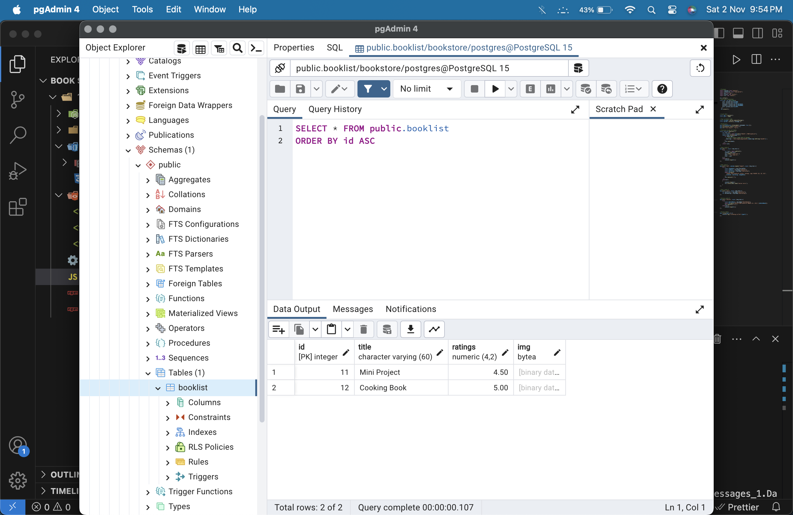
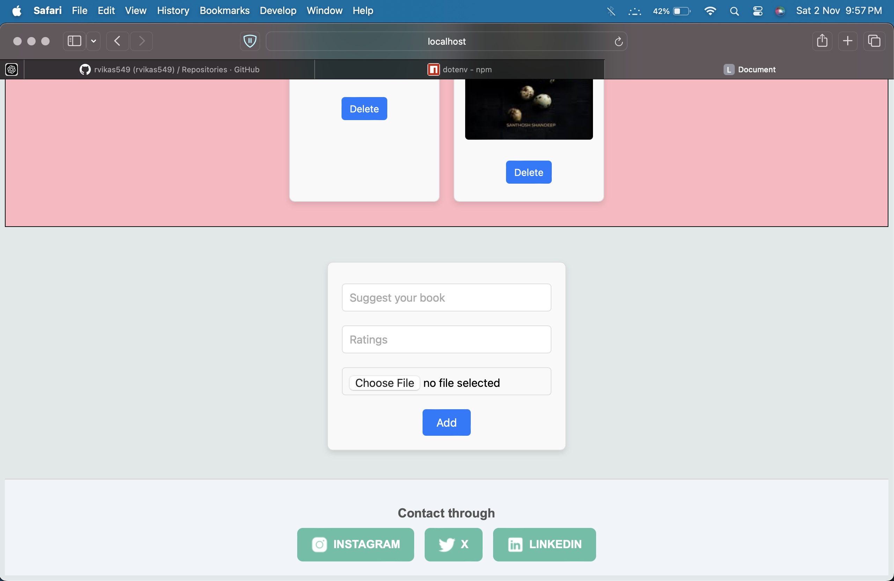

# My-Bookstore-Ratings
Full Stack : Project 1 🥷🏻

-> This project involves about inserting image and storing it in Postgres Database. 

Tools Used:
-Node
-Postgres Database in local computer
-Embedded JavaScript , CSS , Javascript to handle Server

How to run ->
1.git clone <url of this repository> ,in ur terminal
2.Change your directory of the file cd /..
3.npm i for installing packages
4.Run your postgres Database
5.Setup ur .env file with ur database detailes
6.Use nodemon index.js to run 
7.Go to ur browser and search ur localhost:3000/

The image will get converted into bytes and get stored in the database
To Create the Schema follow this steps:

CREATE TABLE booklist (
    id SERIAL PRIMARY KEY,
    title VARCHAR(50),
    ratings decimal(4,2),
    image_data BYTEA
);

Here is the image of Database

Add ur favorite book with image and rating 
Here is sample record of Database
 

*** Do upgrade this project and give a PULL REQUEST to contribute!!😁
I want this project to be more interactive and design I hope a Frontend Engineer will contribute to this Open project

Thank You!!

