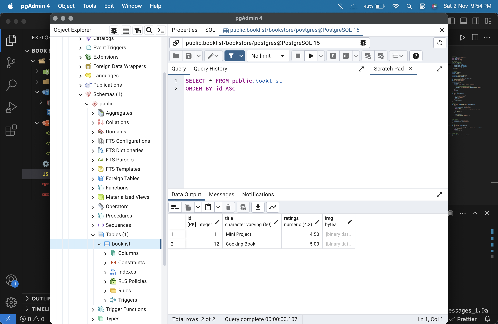
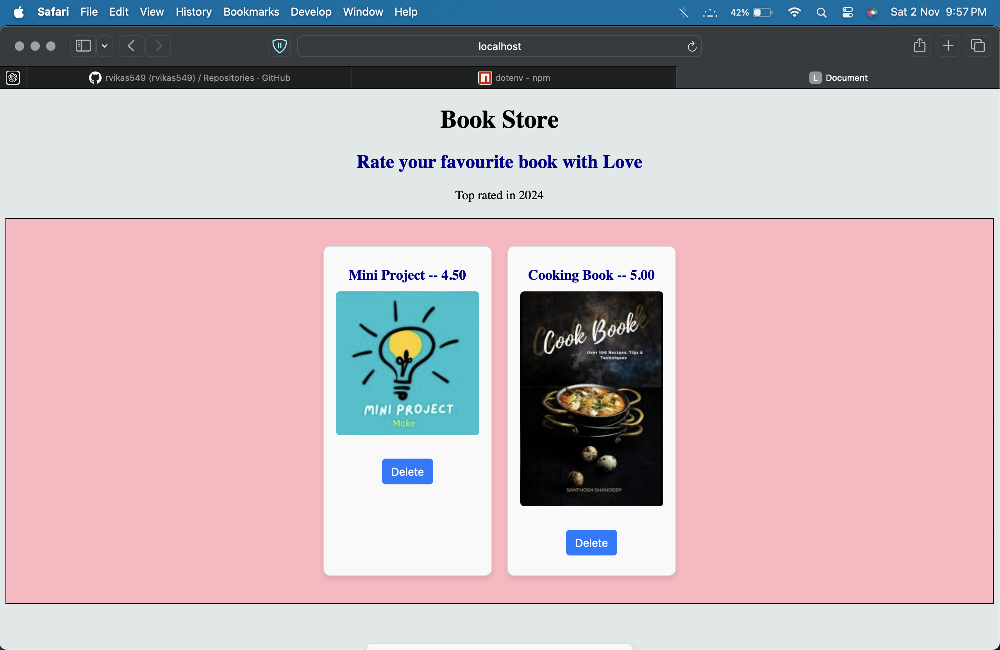
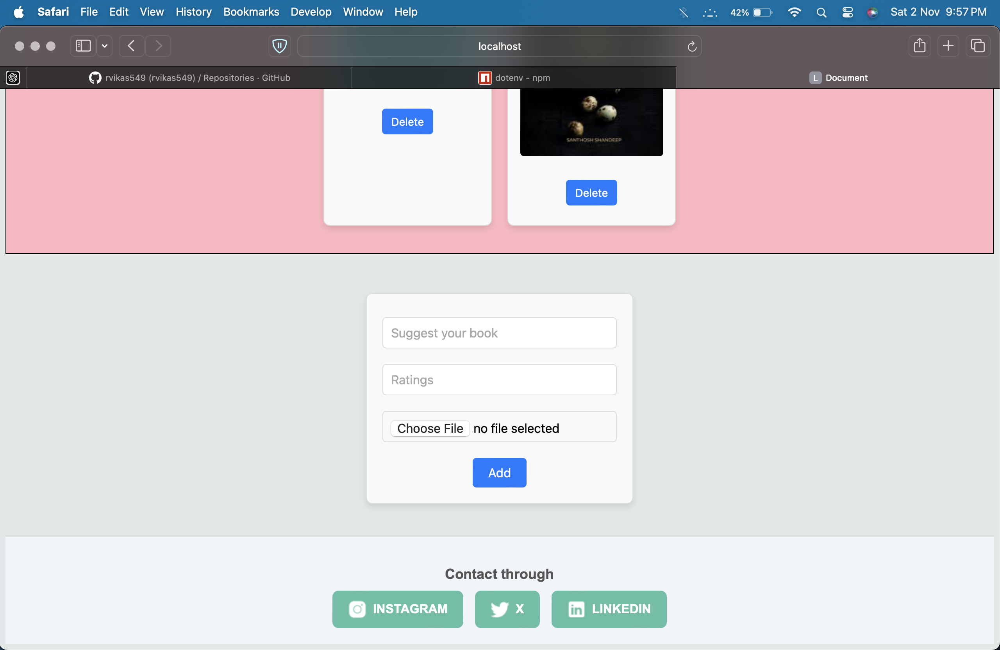

# My-Bookstore-Ratings
<h2>Full Stack : Project 1 🥷🏻</h2>

-> This project involves about inserting image and storing it in Postgres Database. 

<h4>Tools Used:<br></h4>
-Node<br>
-Postgres Database in local computer<br>
-Embedded JavaScript , CSS , Javascript to handle Server<br>


--------------------------------------------------------------------------------------------------------------------------------------------------------------
# 🖼️ Image Storage Strategies in Modern Apps

A guide to understanding how applications store images — from small personal projects to "Meta-scale" systems.

---

## 1. Storage Paradigms

### A. The "Reference" Approach (Industry Standard)

Instead of putting the image in the database, you store the image file in a cloud bucket (AWS S3, Google Cloud Storage) and save only the URL in the database.

**Best for:** 99% of web applications

**Database Entry:**

```json
{
  "username": "dev_user",
  "profile_pic": "https://amazonaws.com/image.jpg"
}
```

**Why?**

* Keeps the database lean
* Enables CDN caching
* Cost-effective

---

### B. The "Binary" Approach (BLOB)

Storing the image directly in the database as a BLOB (Binary Large Object) or BinData.

**Best for:**

* Tiny icons
* Highly secure/private documents

**SQL:**

```sql
VARBINARY(MAX)
-- or
LONGBLOB
```

**NoSQL:**

```js
BinData
// MongoDB GridFS (for files > 16MB)
```

**Why?**

* High data integrity
* But causes database bloat and slow performance at scale

---

## 2. How the Giants Do It (Meta/Facebook Scale)

Large-scale platforms don’t use standard file systems because they are too slow for trillions of files.

| Feature      | Meta's "Haystack" System                                          |
| ------------ | ----------------------------------------------------------------- |
| Storage Unit | Volumes: Thousands of images packed into one giant 100GB+ file    |
| Retrieval    | Uses an in-memory index to find the exact offset of an image      |
| Optimization | Generates multiple sizes (Thumbnail, HD) instantly                |
| Cost Saving  | Deduplication: Same image stored once even if uploaded 1000 times |

---

## 3. Comparison Table

| Feature    | Reference (Cloud) | Binary (DB)       | Big Tech (Object Store) |
| ---------- | ----------------- | ----------------- | ----------------------- |
| Complexity | Low               | Low               | Very High               |
| Speed      | Fast (with CDN)   | Slow              | Ultra-Fast              |
| Cost       | Low               | High              | Efficient at Scale      |
| Use Case   | Most Apps         | Secure/Tiny Files | Facebook, Instagram     |

---

## 4. Implementation Checklist

When choosing a method, ask:

* How big are the images?
  → Under 10KB? DB is okay. Larger? Use Cloud Storage

* How often are they accessed?
  → Use a CDN for high-traffic images

* What is the security level?
  → Does the image need the same permission logic as your database?

---

* Use **cloud storage + URL** for almost everything
* Use **BLOB** only for small or sensitive data
* Big tech uses **custom object storage systems**


--------------------------------------------------------------------------------------------------------------------------------------------------------------


How to run -><br>
1.git clone <url of this repository> ,in ur terminal<br>
2.Change your directory of the file cd /..<br>
3.npm i for installing packages<br>
4.Run your postgres Database<br>
5.Setup ur .env file with ur database detailes<br>
6.Use nodemon index.js to run <br>
7.Go to ur browser and search ur localhost:3000/<br>


The image will get converted into bytes and get stored in the database<br>
To Create the Schema follow this steps:<br>
<strong>
    CREATE TABLE booklist (<br>
        id SERIAL PRIMARY KEY,<br>
        title VARCHAR(50),<br>
        ratings decimal(4,2),<br>
        image_data BYTEA<br>
    );<br>
</strong>
<hr>

Here is the image of Database<br>
<br>


Add ur favorite book with image and rating <br>
Here is sample record of Bookstore<br>
<br>


<hr>
*** Do upgrade this project and give a PULL REQUEST to contribute!!😁<br>
I want this project to be more interactive and design I hope a Frontend Engineer will contribute to this Open project


Thank You!!


