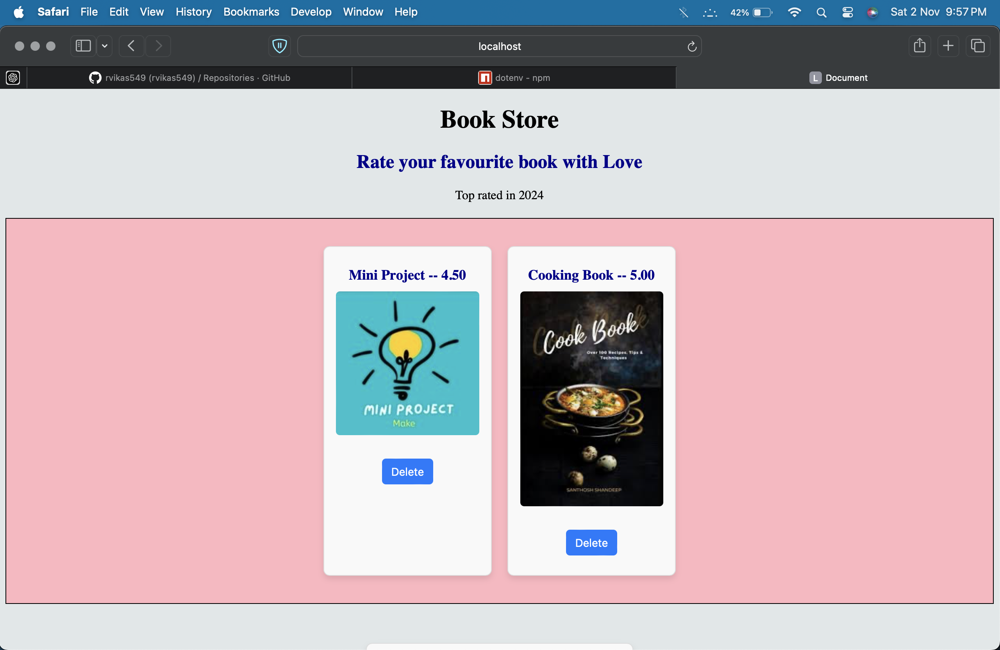

# My-Bookstore-Ratings
<h2>Full Stack : Project 1 🥷🏻</h2>

-> This project involves about inserting image and storing it in Postgres Database. 

<h4>Tools Used: </h4>
-Node 
-Postgres Database in local computer 
-Embedded JavaScript , CSS , Javascript to handle Server 

How to run -> 
1.git clone <url of this repository> ,in ur terminal 
2.Change your directory of the file cd /.. 
3.npm i for installing packages 
4.Run your postgres Database 
5.Setup ur .env file with ur database detailes 
6.Use nodemon index.js to run  
7.Go to ur browser and search ur localhost:3000/ 

The image will get converted into bytes and get stored in the database 
To Create the Schema follow this steps: 
<strong>
    CREATE TABLE booklist ( 
        id SERIAL PRIMARY KEY, 
        title VARCHAR(50), 
        ratings decimal(4,2), 
        image_data BYTEA 
    ); 
</strong>

Here is the image of Database 
 

Add ur favorite book with image and rating  
Here is sample record of Bookstore 
 

*** Do upgrade this project and give a PULL REQUEST to contribute!!😁 
I want this project to be more interactive and design I hope a Frontend Engineer will contribute to this Open project

Thank You!!

